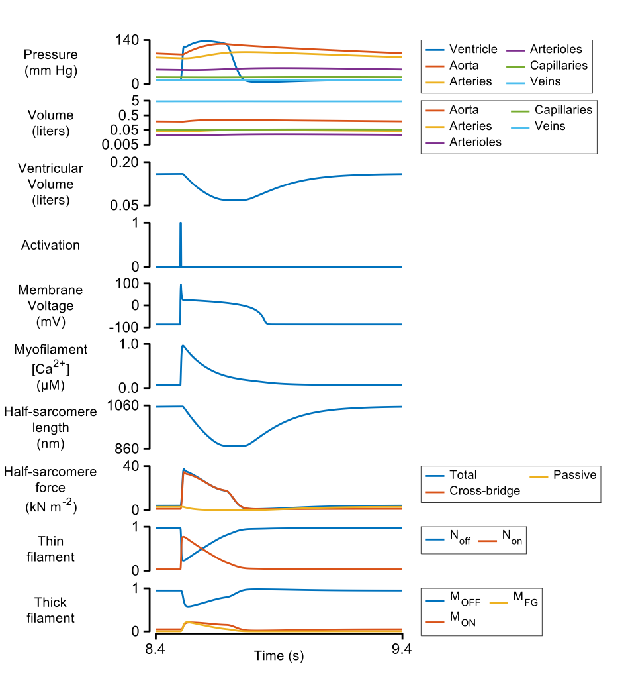

# PyMyoVent
{:.no_toc}

## Overview 

This is the homepage for **PyMyoVent**, software written in Python that simulates a single ventricle pumping blood through a closed circulation.

PyMyoVent is a multiscaled model that bridges from molecular to organ-level function. More information about the different components is provided at [Modules](pages/modules/modules.html). 

Key contributors to the project are listed on the [Team page](pages/team/team.html).

## Example simulation

## Getting started

To get started:
* 1- Get familiar with how to setup the required [environment](../pages/environment/environment.html).
* 2- Then try [Getting Started](../pages/demos/getting_started/getting_started.html).

