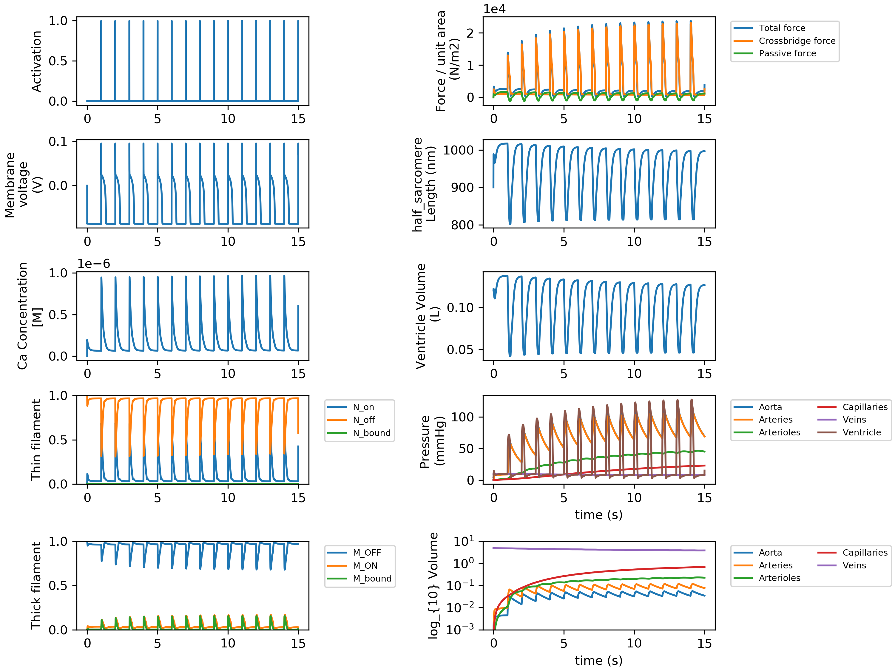

## PyMyoVent
{:.no_toc}

This is the homepage for PyMyoVent, a software written with Python language for simulating a single ventricle pumping blood around a closed circulation.

PyMyoVent is built on various sub-modules and trying to simulate a multi-scale modeling method for the left ventricle. 

To get started:
* 1- Get familiar with how to setup the required [environment](../pages/environment/environment.html).
* 2- Then try [Getting Started](../pages/models/getting_started/getting_started.html).

