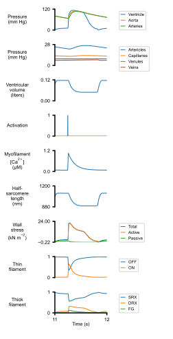

# PyMyoVent
{:.no_toc}

PyMyoVent is reseaach software written in Python that simulates a single ventricle pumping blood through a closed circulation.

The code is fully open-source and available at <https://github.com/Campbell-Muscle-Lab/PyMyoVent>.

The model is multiscaled and bridges from molecular to organ-level function. More information about the different components is provided at [Modules](pages/modules/modules.html). 

