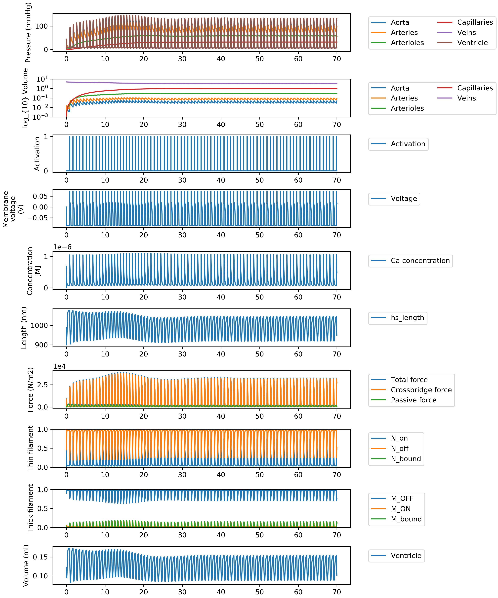
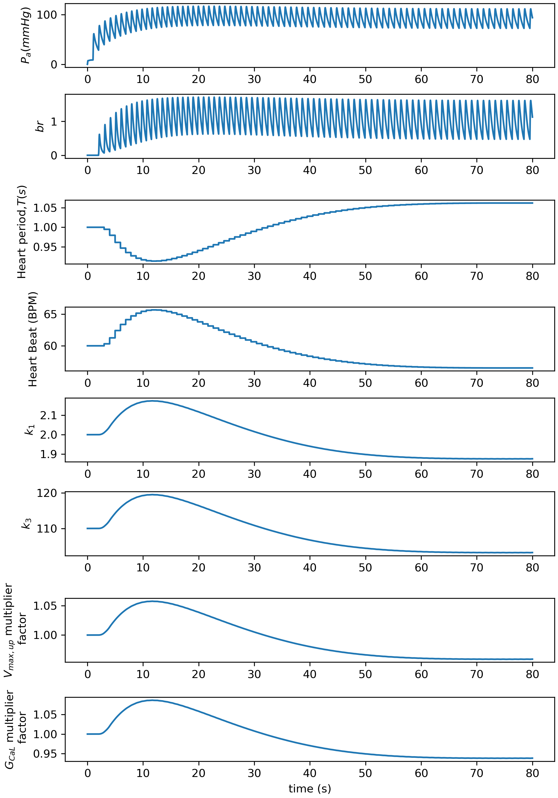
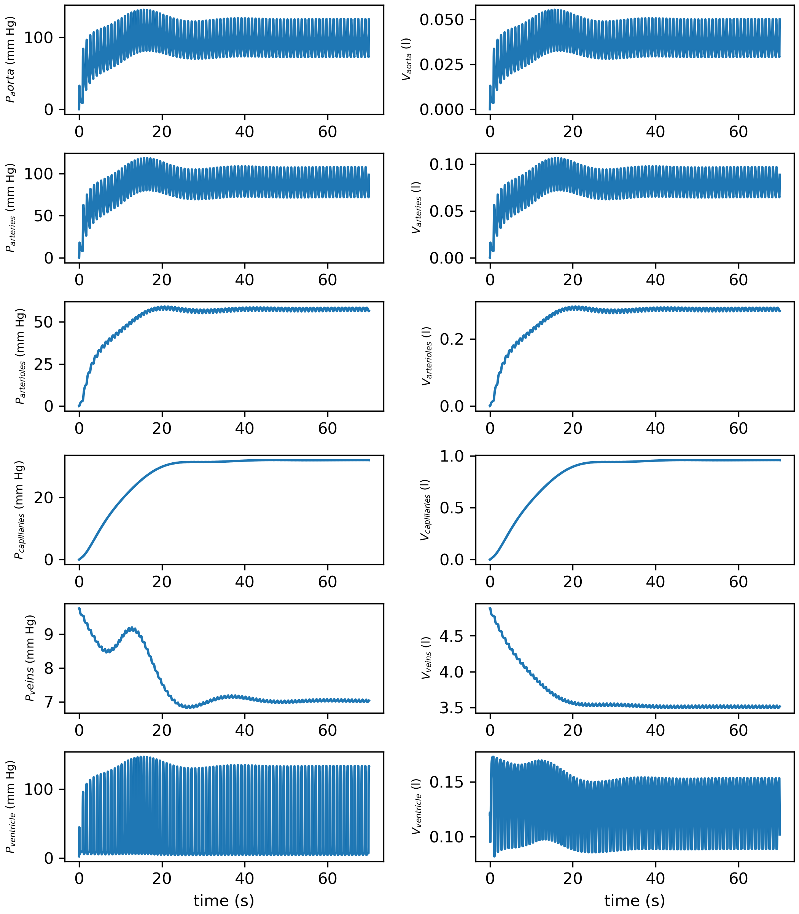
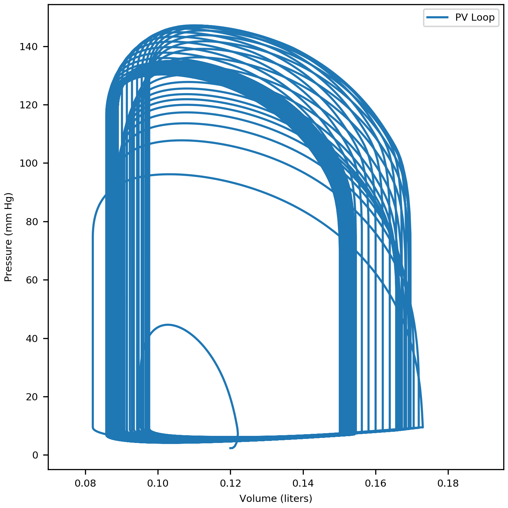
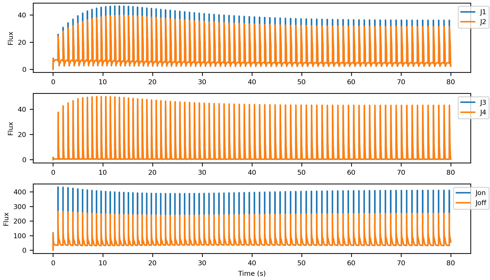
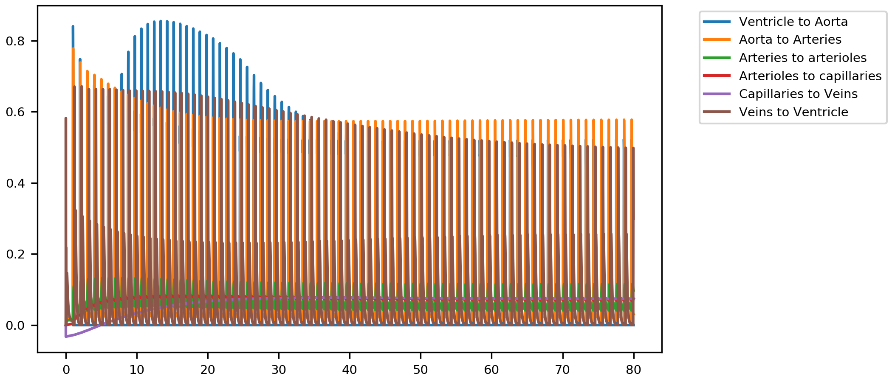

# Baroreceptor (normal loading)
{:.no_toc}

* TOC
{:toc}

## Instruction

* Lunch [Anaconda](http://anaconda.org) prompt.

* Navigate to **Python_code** folder in PyMyoVent's repository directory:
    * `$ cd path_to_PyMyoVent_repo\Python_code`

* Use the following command to run the `Baroreceptor` demo with no perturbation applied to the system.
    * `$ python PyMyoVent.py run_defined_model ..\demo_files\baroreceptor\baroreceptor_model.json`
    * After a few minutes the simulation would be finished.

## Note

* The baroreceptor module starts to regulate the arterial pressure at `"start_index":[5000]`, which can be modified by the user.  
* The baroreceptor module tries to maintain the mean arterial pressure at `87.7 mm Hg`, as a normal level for healthy human, by regulating heart rate, myofilaments contractility, intracellular Ca handling, and vascular tone.
* This model uses an electrophysiology model proposed by [ten Tusscher](http://models.physiomeproject.org/exposure/c7f7ced1e002d9f0af1b56b15a873736/tentusscher_noble_noble_panfilov_2004_a.cellml/view).
* The ventricular loading is normal and no perturbation has applied.

## Instruction file

* The instruction file is written in [JSON format](http://en.wikipedia.org/wiki/JSON#:~:text=JavaScript%20Object%20Notation%20(JSON%2C%20pronounced,or%20any%20other%20serializable%20value).) and is located at `path_to_PyMyoVent_repo\demo_files\baroreceptor\baroreceptor_model.json`.

````
{
  "output_parameters": {
    "input_file": ["..\\temp\\baroreceptor\\baroreceptor.json"],
    "csv_file": ["..\\temp\\baroreceptor\\baroreceptor.csv"],
    "summary_figure": ["..\\temp\\baroreceptor\\baroreceptor_summary.png"],
    "pv_figure": ["..\\temp\\baroreceptor\\baroreceptor_pv.png"],
    "flows_figure": ["..\\temp\\baroreceptor\\baroreceptor_flows.png"],
    "hs_fluxes_figure": ["..\\temp\\baroreceptor\\baroreceptor_hs_fluxes.png"],
    "baro_figure": ["..\\temp\\baroreceptor\\baroreceptor_baro.png"],
    "circulatory": ["..\\temp\\baroreceptor\\baroreceptor_circulation.png"]
  },

  "system_control":{
    "simulation":{
      "no_of_time_points": [70000],
      "time_step": [0.001],
      "duty_ratio": [0.003],
      "basal_heart_period": [0.857,"s"]
    },
    "baroreceptor":{
      "start_index":[5000],
      "N_t":[5000],
      "afferent": {
        "b_max": [2],
        "b_min": [0],
        "S": [0.067,"mmHg"],
        "P_set": [87.7,"mmHg"]
      },
      "efferent":{
        "heart_period":{
          "G_T": [0.07]
        },
        "k_1":{
          "G_k1": [-0.1]
        },
        "k_on":{
          "G_k_on":[0.08]
        },
        "ca_uptake":{
          "G_up": [-0.05]
        },
        "g_cal":{
          "G_gcal": [-0.07]
        },
        "c_venous":{
          "G_c_venous": [0.1]
        },
        "r_arteriolar":{
          "G_r_arteriolar": [-0.1]
        }
      }
    }
  },
  "circulation":{
    "no_of_compartments": [6],
    "blood":{
      "volume":[5,"liters"]
    },
    "aorta":{
      "resistance": [40,"s"],
      "compliance": [0.0004,"liter_per_mmHg"]
    },
    "arteries":{
      "resistance": [80,"s"],
      "compliance": [0.0009,"liter_per_mmHg"]
    },
    "arterioles":{
      "resistance": [400,"s"],
      "compliance": [0.005,"liter_per_mmHg"]
    },
    "capillaries":{
      "resistance": [340,"s"],
      "compliance": [0.03,"liter_per_mmHg"]
    },
    "veins":{
      "resistance": [330,"s"],
      "compliance": [0.5,"liter_per_mmHg"]
    },
    "ventricle":{
      "resistance": [10,"s"],
      "wall_volume": [0.1,"liters"],
      "slack_volume": [0.08,"liters"],
      "wall_density": [1055,"g/l"],
      "body_surface_area": [1.90,"m^2"]
    }
  },
  "half_sarcomere":{
    "max_rate": [5000,"s^-1"],
    "temperature": [288, "Kelvin"],
    "cb_number_density": [6.9e16, "number of cb's/m^2"],
    "initial_hs_length": [900, "nm"],
    "ATPase_activation":[false],
    "delta_energy":[70,"kJ/mol"],
    "avagadro_number":[6.02e23,"mol^-1"],
    "reference_hs_length":[1100,"nm"],

    "myofilaments":{
      "kinetic_scheme": ["3state_with_SRX"],
      "k_1": [2,"s^-1"],
      "k_force": [0.6e-3, "(N^-1)(m^2)"],
      "k_2": [200, "s^-1"],
      "k_3": [100, "(nm^-1)(s^-1)"],
      "k_4_0": [200, "s^-1"],
      "k_4_1": [0.3, "nm^-4"],
      "k_cb": [0.001, "N*m^-1"],
      "x_ps": [5, "nm"],
      "k_on": [5e8, "(M^-1)(s^-1)"],
      "k_off": [200, "s^-1"],
      "k_coop": [5],
      "bin_min": [-10, "nm"],
      "bin_max": [10, "nm"],
      "bin_width": [1, "nm"],
      "filament_compliance_factor": [0.5],
      "thick_filament_length": [815, "nm"],
      "thin_filament_length": [1120, "nm"],
      "bare_zone_length": [80, "nm"],
      "k_falloff": [0.0024],
      "passive_mode": ["exponential"],
      "passive_exp_sigma": [300],
      "passive_exp_L": [80],
      "passive_l_slack": [900, "nm"]
    },
    "membranes": {
      "kinetic_scheme": ["Ten_Tusscher_2004"],
      "simple_2_compartment":{
        "Ca_content": [1e-3],
        "k_leak": [2e-3],
        "k_act": [5e-2],
        "k_serca": [10.0]
      },
      "Ten_Tusscher_2004":{
        "g_to_factor": [1],
        "g_Kr_factor": [1],
        "g_Ks_factor": [1],
        "Ca_a_rel_factor": [1],
        "Ca_V_leak_factor": [1],
        "Ca_Vmax_up_factor": [1],
        "g_CaL_factor": [1]
    }
  }
},
  "profiling":{
    "profiling_activation":[false]
  },
  "saving_to_spreadsheet":{
    "saving_data_activation":[false],
    "output_data_format":["csv"],
    "start_index":[0],
    "stop_index":[30000]
  }
}


````
## Outputs

When the simulation is funished up, this set of output figures will be shown up in `path_to_PyMyoVent_repo\temp\baroreceptor` directory.

* Simmulation summary output



* Baroreceptor output



* Systemic circulation output


* P_V loop output



* Fluxes output


* Blood flows output


