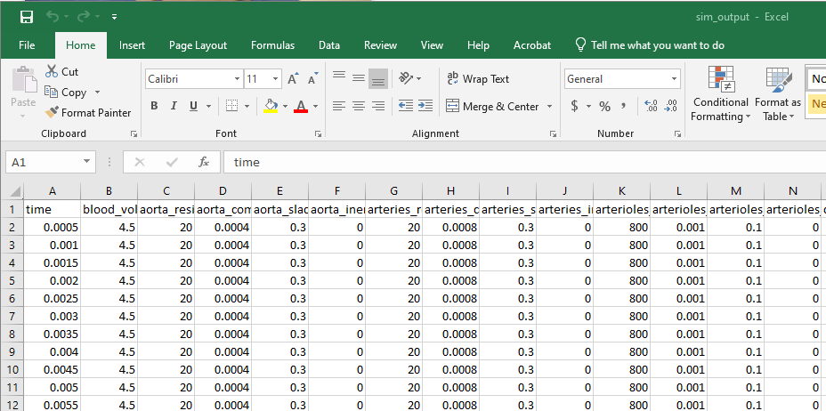
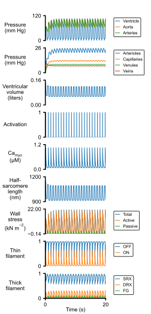
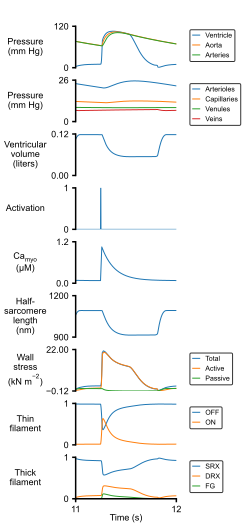

# Base simulation

## Instructions

+ Install the software [as described](../../../installation/installation.html)
  + This manuscript is based on PyMyoVent 1.2.1
+ Open an Anaconda prompt
+ Activate the PyMyoVent environment
+ Change directory to `<PyMyoVent_repo>/Python_code`
+ Run the commmand `python pymyovent.py run_batch ../demos/getting_started/base_sim/batch_base_sim.json`
  + This may take ~2 minutes
+ Use File Explorer or similar to open `<PyMyoVent_repo>/demos/getting_started/base_sim/sim_output`. You should see
  + Simulation results and figures will be in the `sim_output` folder
  
## Output

`sim_output.txt` (a tab-delimited file, shown here opened in Excel)
 

 

 
