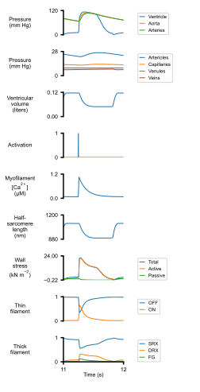

# Base simulation

## Instructions

+ Install the software [as described](../../../installation/installation.html)
  + This manuscript is based on PyMyoVent 1.2.1
+ Open an Anaconda prompt
+ Activate the PyMyoVent environment
+ Change directory to `<PyMyoVent_repo>/Python_code`
+ Run the commmand `python pymyovent.py run_batch ../manuscripts/demos/getting_started/base_simulation/batch_base_simulation.json`
  + This may take ~2 minutes
+ Use File Explorer or similar to open `<PyMyoVent_repo>/demos/getting_started/base_simulation/sim_output`
  + Simulation results will be in the `results` folder
  + Figures will be in the `images` folder

## Output

 
