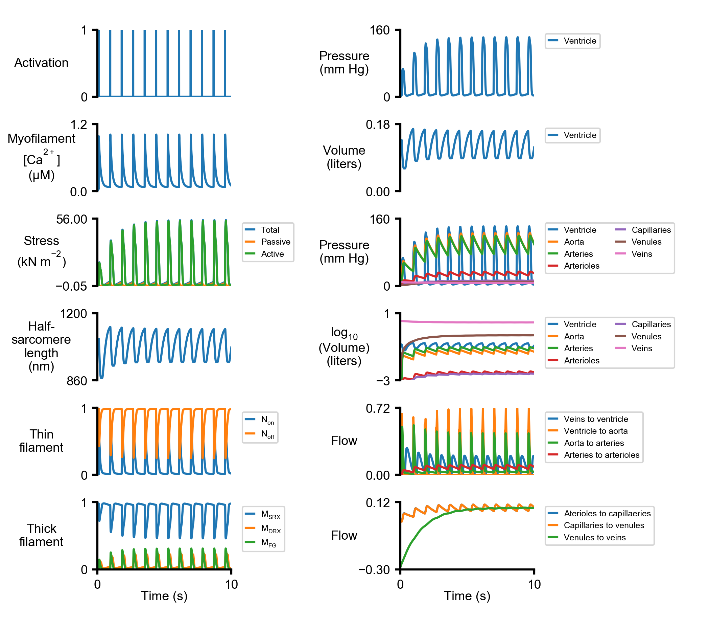

# Getting Started
{:.no_toc}

- Run the following steps to be able to run this demo.

* TOC
{:toc}
## Instruction

1. First open the **PyMyoVent** repository folder on your local machine.

2. Navigate to **demo_files** folder.

3. Open `batch.json` file with your favorite text editor software. If you want to get more familiar with
`batch.json` visit this [link](../../structures/structures.html).

4. In `batch.json` file, you need to define a job representing the **getting_started** demo. To do that,
you need to properly change the pathway string to the main three input files as follows:

````
{
    "job":
    [
        {
            "model_file_string": "../demo_files/getting_started/getting_started_model.json",
            "protocol_file_string": "../demo_files/getting_started/getting_started_protocol.json",
            "output_handler_file_string": "../demo_files/getting_started/getting_started_output_handler.json"
        }
    ]
}
````

5. Save the above changes.

6. Lunch [Anaconda](http://anaconda.org) prompt if you are using a machine with [windos OS](http://en.wikipedia.org/wiki/Microsoft_Windows). Otherwise, just open the terminal on macintosh or linux OS systems.

7. Navigate to **Python_code** folder in PyMyoVent's repository directory using the below command:
    * `$ cd path_to_PyMyoVent_repo/Python_code`

8. Use the following command to run the `Getting_started` demo.
    * `$ python PyMyoVent.py`
    * After a few minutes, the simulation will be completed.

## Notes

- This demo :

  * Runs with a fixed heart rate of 70 BPM with no baroreflex control loop.

  * Uses a simple two compartment model as the electrophysiological model.


## Outputs

- After finishing the simulation, if you go to **temp** folder in **PyMyoVent** repository, you will see a folder
 named **getting_started** is created and it contains two files:
  1. `output_data.csv`
  2. `summary_image.png`

- The `summary_image.png` file should look like the below figure.  


