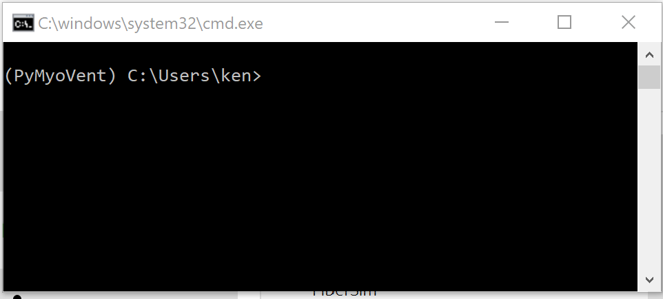
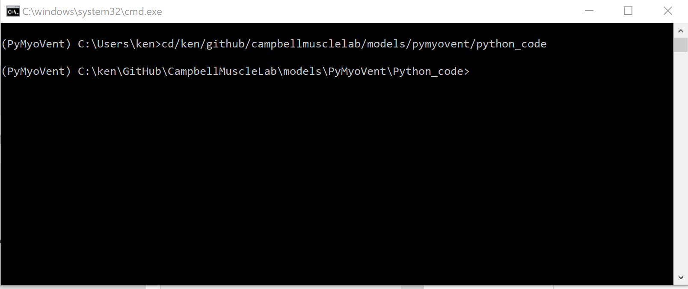
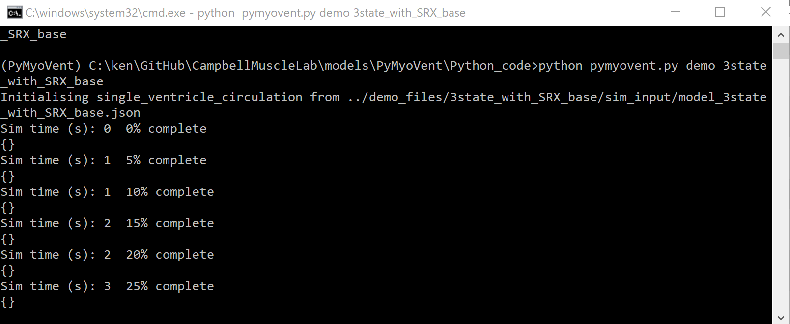
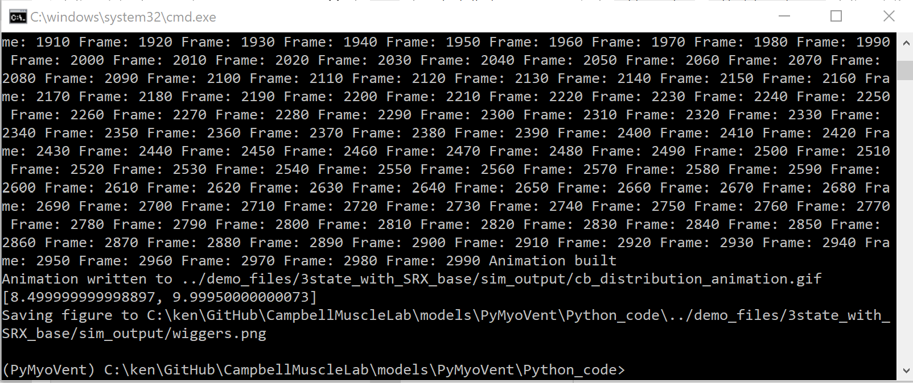
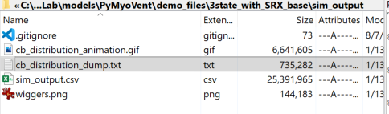
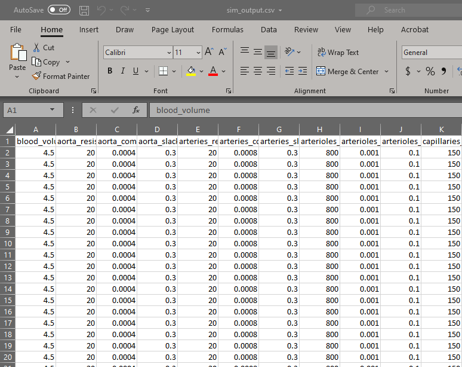
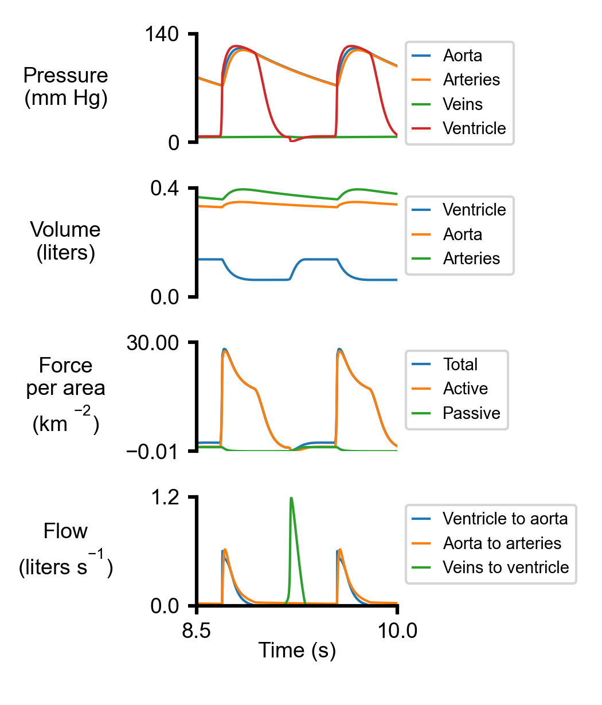
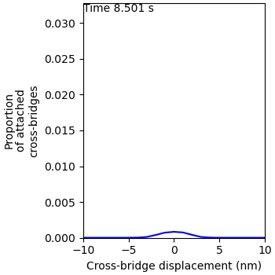

# Getting Started

## Overview

This page explains how to run a simple simulation. The other demos build from this example so this page is the best place to start if you want to learn how to use PyMyoVent for your own work.

## Assumptions

We assume that you have
+ installed Anaconda
  + see [howtos Anaconda](https://campbell-muscle-lab.github.io/howtos_Python/pages/anaconda/anaconda.html) if you need help
+ have pulled the latest version of the [PyMyoVent repository](https://github.com/Campbell-Muscle-Lab/PyMyoVent) from GitHub
  + see [howtos GitHub](https://campbell-muscle-lab.github.io/howtos_GitHub/pages/github_repos/github_repos.html)
+ activated the PyMyoVent environment
  + see [howtos using an existing environment](https://campbell-muscle-lab.github.io/howtos_Python/pages/anaconda/anaconda.html#using-an-existing-environment)
+ have opened a command prompt for the environment
  + see [howtos via command line](https://campbell-muscle-lab.github.io/howtos_Python/pages/anaconda/anaconda.html#via-command-line)

If you have followed these instructions, you should see a window that looks like this. (Note that your path will be different but it should start `(PyMyoVent)`).

## Running the demo

+ Change your directory to `<repo>/Python_code` where `<repo>` is the top-level directory for the files that you pulled from GitHub.
  + In this example, we type `cd c:/ken/github/campbellmusclelab/models/pymyovent`

+ Type `python pymyovent.py demo 3state_with_SRX_base`
+ After a few seconds you should see some text printing to the screen

+ After a minute or so, the code will finish leaving you back at the command prompt

## Finding the results

+ Use File explorer or similar to look at `<repo>/demo_files/3state_with_SRX_base/sim_output`

You should find some new files including:

+ `sim_output.csv` - this is a Comma Separated Value (a type of text file you can open in Excel or a text editor). It includes all of the information from the simulation.

Here is the top left corner.

+ `wiggers.png` - this is an image file showing the last few seconds of the simulation as a Wiggers diagram

+ `cb_distribution_animation.gif` - this is an animation of the data written to `cb_distribution_dump.txt` which shows the number of myosin heads attached with different displacements as a function of time during the cardiac cycle.

That's it. You've run a simulation and created a figure of a Wiggers diagram that summarizes cardiovascular function.

The rest of this page explains what the code did.

## What the code did

