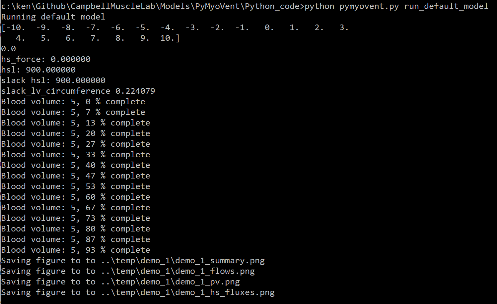
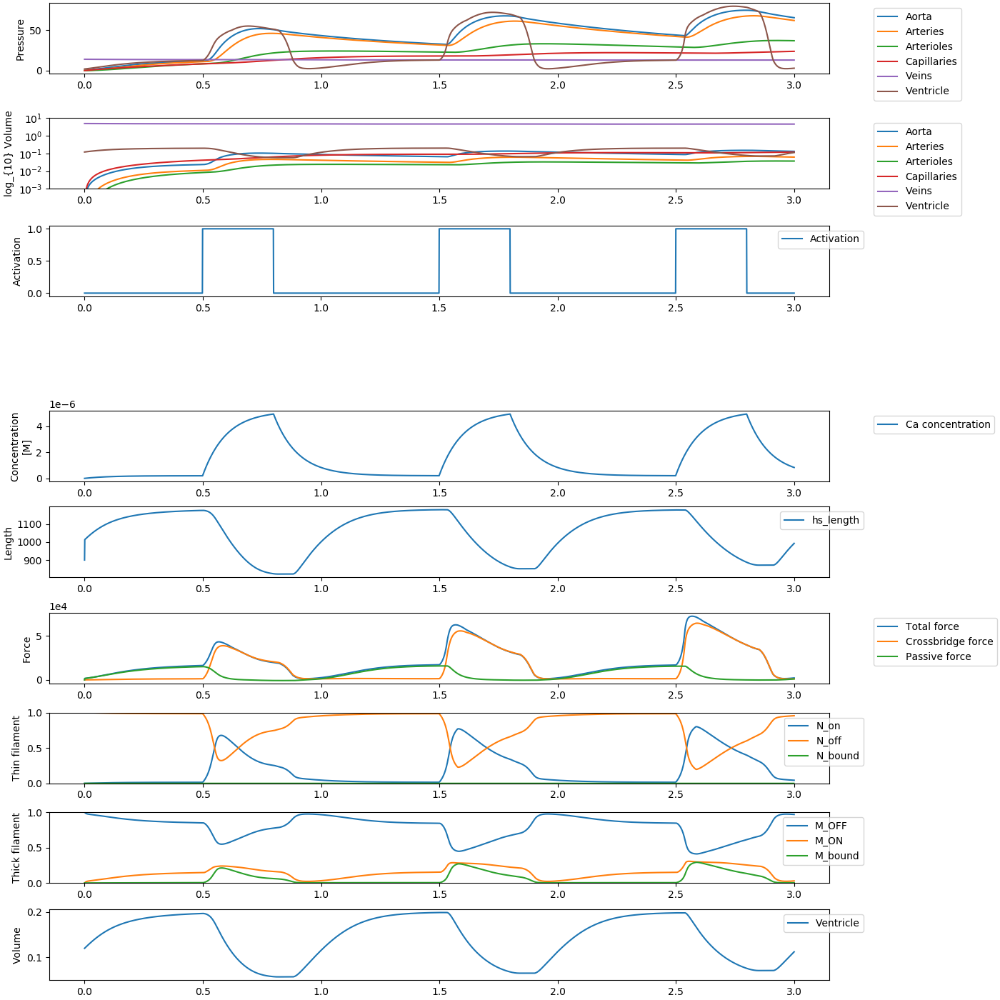
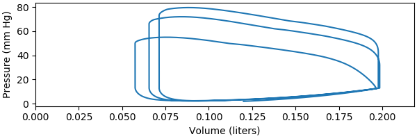
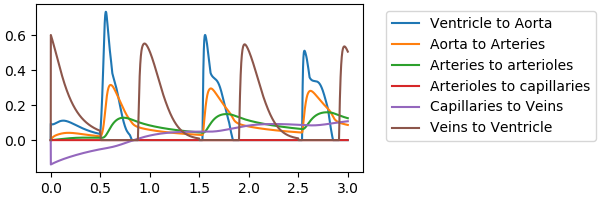
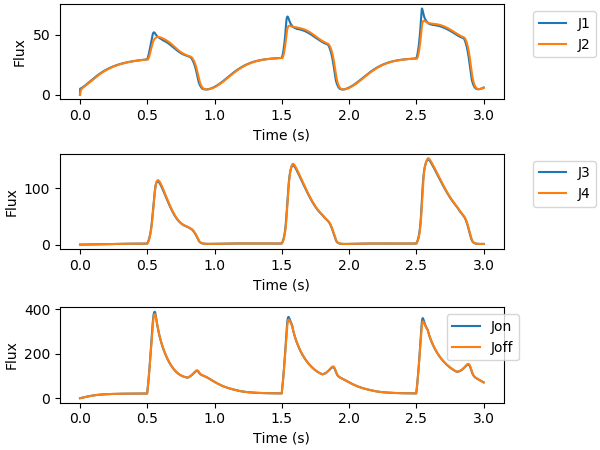

### Run the default model

1. Activate a command prompt using the [PyMyoVent environment](..\environment.html) 
  + follow the instructions in out [environment tutorial[(..\anaconda.pdf) if you need help

1. Change the directory to the Python_code folder of your repository
   + If you installed PyMyoVent in `c:\users\your_username_here\GitHub\PyMyoVent`  
you can type  
`cd c:\users\your_username_here\GitHub\PyMyoVent\Python_code`  
and press enter

1. In the command window, type  
`python PyMyoVent.py run_default_model`  
and press enter

1. Wait a few seconds and you should see

1. Now open file explorer (the program you use to look for files on your hard-drive)
  + Go to the base folder of your repository
    + for example, `c:\users\your_username_here\GitHub\PyMyoVent`
  + Now look in the `temp\demo_1` folder
  + You should see the following images

