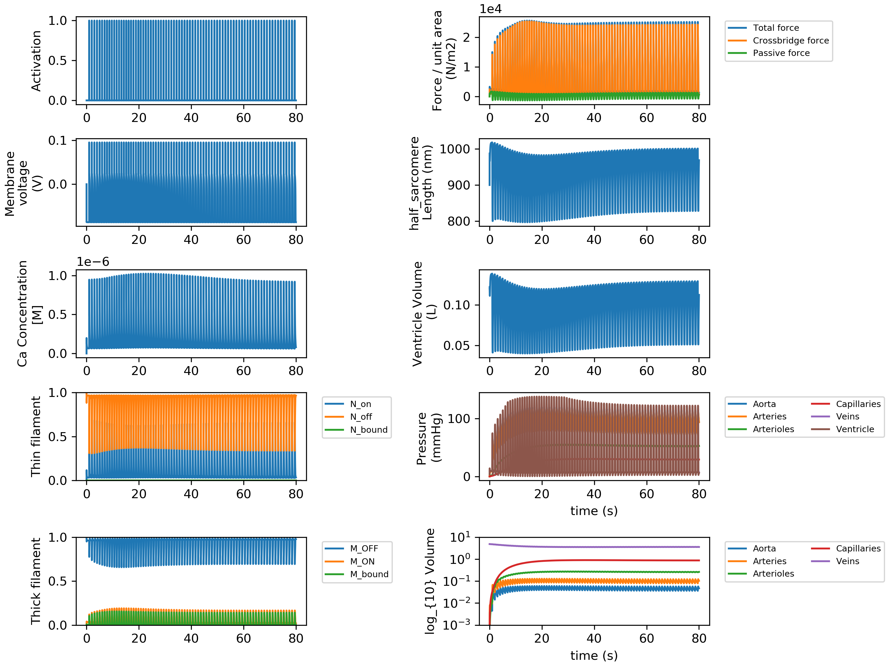
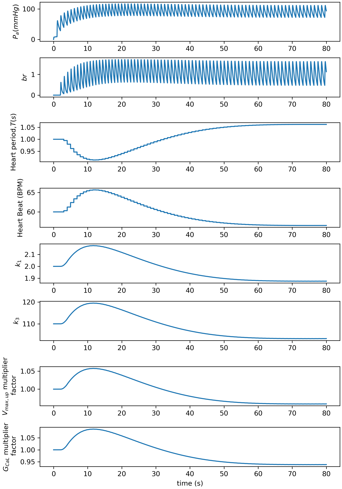
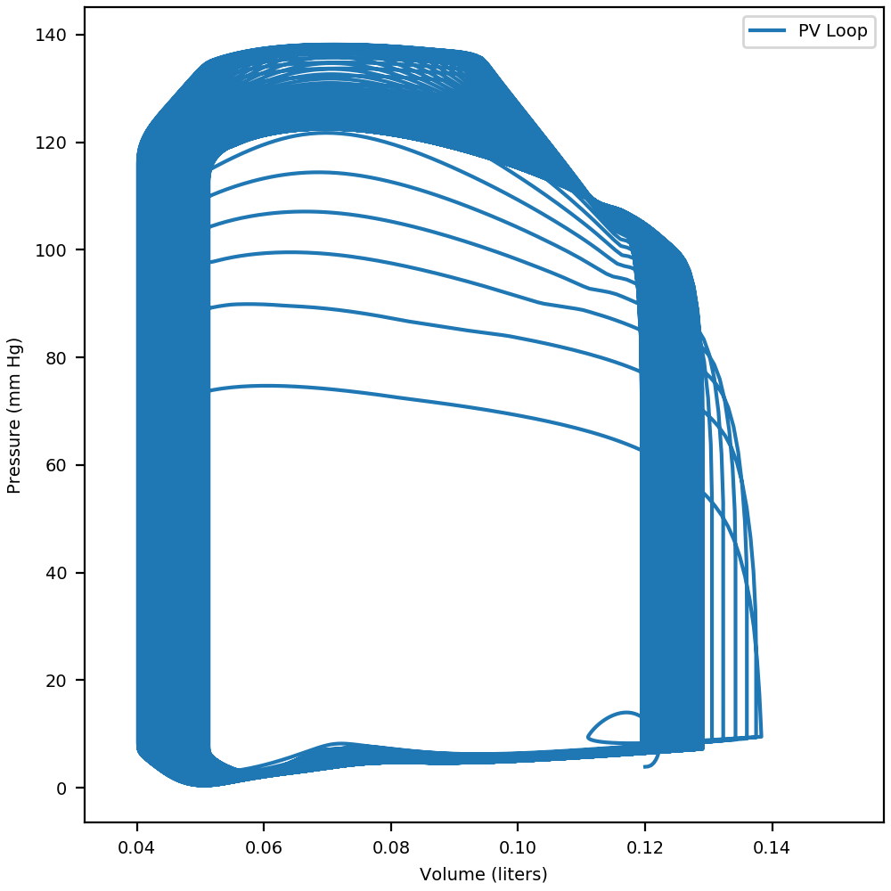
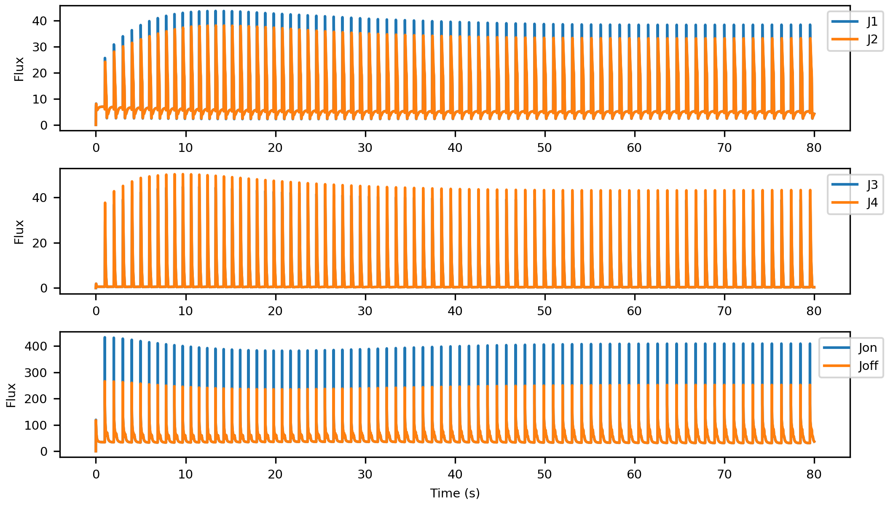
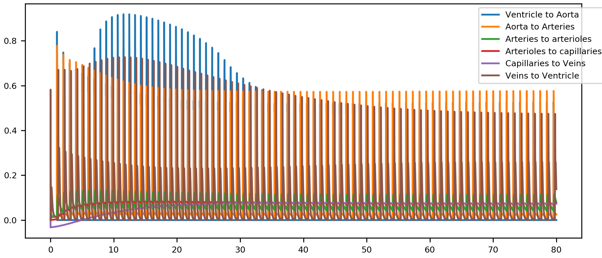

## Baroreceptor Steady State
{:.no_toc}

* TOC
{:toc}

## Instruction

* Lunch [Anaconda](http://anaconda.org) prompt. 

* Navigate to **Python_code** folder in PyMyoVent's repository directory:
    * `$ cd path_to_PyMyoVent_repo\Python_code`

* Use the following command to run the `Baroreceptor` demo with no perturbation applied to the system.
    * `$ python PyMyoVent.py run_defined_model ..\demo_files\baroreceptor\baroreceptor_model.json`
    * After a few minutes the simulation would be finished. 

## Note 

* In this model, the baroreceptor module is activated by putting `"baro_scheme": ["simple_baroreceptor"]` in the instruction file.  
* The baroreceptor module starts to regulate the arterial pressure after `"start_index":[2000]`, which can be modified by user.  
* The baroreceptor module tries to maintain the mean arterial pressure at `90 mm Hg` by continously regulation of heart rate, myofilaments contractility, and calcium handling.
* This model uses an electrophys model proposed by [Ten Tusscher](http://models.physiomeproject.org/exposure/c7f7ced1e002d9f0af1b56b15a873736/tentusscher_noble_noble_panfilov_2004_a.cellml/view).
* No perturbation is applied to the simulation as long as `"perturbation_activation":[false]` in the instruction file. 

## Instruction file

* The instruction file is written in [JSON format](http://en.wikipedia.org/wiki/JSON#:~:text=JavaScript%20Object%20Notation%20(JSON%2C%20pronounced,or%20any%20other%20serializable%20value).) and is located at `path_to_PyMyoVent_repo\demo_files\baroreceptor\baroreceptor_model.json`.

````
{
  "output_parameters": {
    "excel_file": ["..\\temp\\baroreceptor\\baroreceptor.xlsx"],
    "input_file": ["..\\temp\\baroreceptor\\baroreceptor.json"],
    "summary_figure": ["..\\temp\\baroreceptor\\baroreceptor_summary.png"],
    "force_length": ["..\\temp\\baroreceptor\\baroreceptor_F_L.png"],
    "pv_figure": ["..\\temp\\baroreceptor\\baroreceptor_pv.png"],
    "baro_figure": ["..\\temp\\baroreceptor\\baroreceptor_baro.png"],
    "flows_figure": ["..\\temp\\baroreceptor\\baroreceptor_flows.png"],
    "hs_fluxes_figure": ["..\\temp\\baroreceptor\\baroreceptor_hs_fluxes.png"],
    "multi_threading":["..\\temp\\baroreceptor\\baroreceptor_multi_thread.png"]
  },
  "baroreflex": {
    "baro_scheme": ["simple_baroreceptor"],
    "fixed_heart_rate":{
      "simulation":{
        "no_of_time_points": [160000],
        "time_step": [0.001],
        "duty_ratio": [0.003],
        "basal_heart_period": [1,"s"]
      }
    },
    "simple_baroreceptor":{
      "simulation":{
        "start_index":[2000],
        "memory":[2,"s"],
        "no_of_time_points": [80000],
        "time_step": [0.001],
        "duty_ratio": [0.003],
        "basal_heart_period": [1,"s"]
      },
      "afferent": {
        "bc_max": [2],
        "bc_min": [0],
        "slope": [15,"mmHg"],
        "P_n": [90,"mmHg"]
      },
      "regulation":{
        "heart_period":{
          "G_T": [0.03]
        },
        "k_1":{
          "G_k1": [-0.03]
        },
        "k_3":{
          "G_k3": [-0.03]
        },
        "ca_uptake":{
          "G_up": [-0.02]
        },
        "g_cal":{
          "G_gcal": [-0.03]
        }
      }
    }
  },
  "perturbations": {
    "perturbation_activation":[false],
    "volume":{
      "start_index": [85000],
      "stop_index": [90000],
      "increment": [0]
    },
    "valve":{
      "aortic":{
        "start_index": [0],
        "stop_index": [505000],
        "increment": [0.0]
      },
      "mitral":{
        "start_index": [400000],
        "stop_index": [1000000],
        "increment": [0.0]
      }
    },
    "compliance": {
      "aorta":{
        "start_index": [200000],
        "stop_index": [205000],
        "increment": [0]
      },
      "capillaries": {
        "start_index": [200000],
        "stop_index": [205000],
        "increment": [0]
      },
      "venous":{
        "start_index": [500000],
        "stop_index": [505000],
        "increment": [0]
      }
    },
    "resistance": {
      "aorta":{
        "start_index": [400000],
        "stop_index": [410000],
        "increment": [0.0]
      },
      "capillaries": {
        "start_index": [500000],
        "stop_index": [505000],
        "increment": [0]
      },
      "venous":{
        "start_index": [85000],
        "stop_index": [90000],
        "increment": [-3e-2]
      },
      "ventricle":{
        "start_index": [500000],
        "stop_index": [505000],
        "increment": [0]
      }
    },
    "myosim":{
      "k_1":{
        "start_index": [25000],
        "stop_index": [25001],
        "increment": [0]
      },
      "k_2":{
        "start_index": [25000],
        "stop_index": [35000],
        "increment": [0.0]
      },
      "k_4_0":{
        "start_index": [200000],
        "stop_index": [210000],
        "increment": [0]
      }
    },
    "ca_handling":{
      "ca_uptake":{
        "start_index": [40000],
        "stop_index": [41000],
        "increment": [0]
      },
      "ca_leak":{
        "start_index": [40000],
        "stop_index": [41000],
        "increment": [0]
      },
      "g_cal":{
        "start_index": [40000],
        "stop_index": [41000],
        "increment": [0]
      }
    }
  },
  "circulation":{
    "no_of_compartments": [6],
    "blood":{
      "volume":[5,"liters"]
    },
    "aorta":{
      "resistance": [40,"s"],
      "compliance": [0.0005,"liter_per_mmHg"]
    },
    "arteries":{
      "resistance": [20,"s"],
      "compliance": [0.0011,"liter_per_mmHg"]
    },
    "arterioles":{
      "resistance": [520,"s"],
      "compliance": [0.005,"liter_per_mmHg"]
    },
    "capillaries":{
      "resistance": [310,"s"],
      "compliance": [0.03,"liter_per_mmHg"]
    },
    "veins":{
      "resistance": [300,"s"],
      "compliance": [0.5,"liter_per_mmHg"]
    },
    "ventricle":{
      "resistance": [10,"s"],
      "wall_volume": [0.1,"liters"],
      "slack_volume": [0.08,"liters"],
      "wall_density": [1055,"g/l"],
      "body_surface_area": [1.90,"m^2"]
    }
  },
  "half_sarcomere":{
    "max_rate": [5000,"s^-1"],
    "temperature": [288, "Kelvin"],
    "cb_number_density": [6.9e16, "number of cb's/m^2"],
    "initial_hs_length": [900, "nm"],
    "ATPase_activation":[false],
    "delta_energy":[70,"kJ/mol"],
    "avagadro_number":[6.02e23,"mol^-1"],
    "referench_hs_length":[1100,"nm"],

    "myofilaments":{
      "kinetic_scheme": ["3state_with_SRX"],
      "k_1": [2,"s^-1"],
      "k_force": [1e-3, "(N^-1)(m^2)"],
      "k_2": [200, "s^-1"],
      "k_3": [110, "(nm^-1)(s^-1)"],
      "k_4_0": [200, "s^-1"],
      "k_4_1": [0.3, "nm^-4"],
      "k_cb": [0.001, "N*m^-1"],
      "x_ps": [5, "nm"],
      "k_on": [6e8, "(M^-1)(s^-1)"],
      "k_off": [200, "s^-1"],
      "k_coop": [5],
      "bin_min": [-10, "nm"],
      "bin_max": [10, "nm"],
      "bin_width": [1, "nm"],
      "filament_compliance_factor": [0.5],
      "thick_filament_length": [815, "nm"],
      "thin_filament_length": [1120, "nm"],
      "bare_zone_length": [80, "nm"],
      "k_falloff": [0.0024],
      "passive_mode": ["exponential"],
      "passive_exp_sigma": [500],
      "passive_exp_L": [80],
      "passive_l_slack": [900, "nm"]
    },
    "membranes": {
      "kinetic_scheme": ["Ten_Tusscher_2004"],
      "simple_2_compartment":{
        "Ca_content": [1e-3],
        "k_leak": [2e-3],
        "k_act": [5e-2],
        "k_serca": [10.0]
      },
      "Ten_Tusscher_2004":{
        "g_to_factor": [1],
        "g_Kr_factor": [1],
        "g_Ks_factor": [1],
        "Ca_a_rel_factor": [1],
        "Ca_V_leak_factor": [1],
        "Ca_Vmax_up_factor": [1],
        "g_CaL_factor": [1]
    }
  }
},
  "growth": {
    "growth_activation": [false],
    "start_index": [50000],
    "moving_average_window": [5000],
    "driven_signal": ["stress"],
    "concenrtric":{
      "G_stress_driven":[1e-6],
      "G_ATPase_driven":[1]
    },
    "eccentric":{
      "G_number_of_hs":[-3e-6],
      "G_ATPase_driven":[-2]
    }
  },
  "profiling":{
    "profiling_activation":[false]
  },
  "saving_to_spreadsheet":{
    "saving_data_activation":[false],
    "start_index":[0],
    "stop_index":[1000]
  },
  "multi_threads" :{
    "multithreading_activation":[false],
    "parameters_in":{
      "G_T": {
        "values":[25,50,100,150,175],
        "param_out":["heart_rate"],
        "section": ["baroreflex"]
      },
      "G_k1": {
        "values":[25,50,100,150,175],
        "param_out":["k_1"],
        "section": ["baroreflex"]
      },
      "G_k3": {
        "values":[25,50,100,150,175],
        "param_out":["k_3"],
        "section": ["baroreflex"]
      },
      "G_up": {
        "values":[25,50,100,150,175],
        "param_out":["Ca_Vmax_up_factor"],
        "section": ["baroreflex"]
      },
      "G_gcal": {
        "values":[25,50,100,150,175],
        "param_out":["g_CaL_factor"],
        "section": ["baroreflex"]
      }
    },
    "output_main_folder": ["..\\temp\\baroreceptor\\demo_i_j\\demo_i_j.json"]
  }
}

````
## Outputs
* Simmulation summary output



* Baroreceptor output



* P_V loop output



* Fluxes output 


* Blood flows output 


