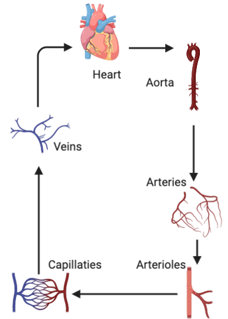
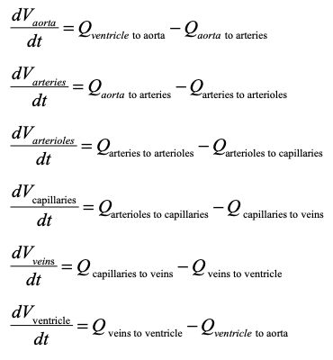
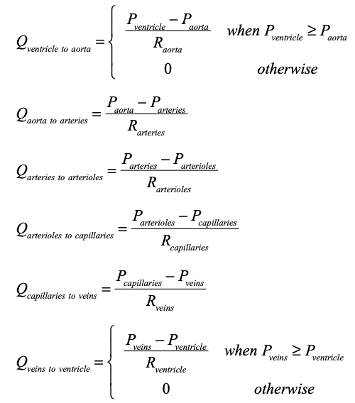
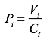

# Circulatory
{:.no_toc}

* Toc 
{:toc}

## Overview

A zero dimensional (lumped parameters) circulatory model including six compartments (aorta, arteries, arterioles, capillaries, veins, ventricle) is employed in the **PyMyoVent** framework.



## Theory

- The blood volume in each compartment depends on the blood flow gradient across the compartment.



- Where *Q<sub>(i to j)</sub>* represents the blood flow between compartment *i* and *j*.

- The blood flow between compartments is governed by Ohm’s law.



- The blood pressure in each compartment, except the ventricle, is related to the corresponding blood volume with a compliance factor.



## Parameters 

The parameters for the **circulatory** module are tuned in a way to mimic the phisology of a healthy adult. Their values are located at the *circulation* section of the instruction file. 

```
"circulation":{
    "no_of_compartments": [6],
    "blood":{
      "volume":[5,"liters"]
    },
    "aorta":{
      "resistance": [40,"s"],
      "compliance": [0.0005,"liter_per_mmHg"]
    },
    "arteries":{
      "resistance": [20,"s"],
      "compliance": [0.0011,"liter_per_mmHg"]
    },
    "arterioles":{
      "resistance": [520,"s"],
      "compliance": [0.005,"liter_per_mmHg"]
    },
    "capillaries":{
      "resistance": [310,"s"],
      "compliance": [0.03,"liter_per_mmHg"]
    },
    "veins":{
      "resistance": [300,"s"],
      "compliance": [0.5,"liter_per_mmHg"]
    },
    "ventricle":{
      "resistance": [10,"s"],
      "wall_volume": [0.1,"liters"],
      "slack_volume": [0.08,"liters"],
      "wall_density": [1055,"g/l"],
      "body_surface_area": [1.90,"m^2"]
    }
  },
```

