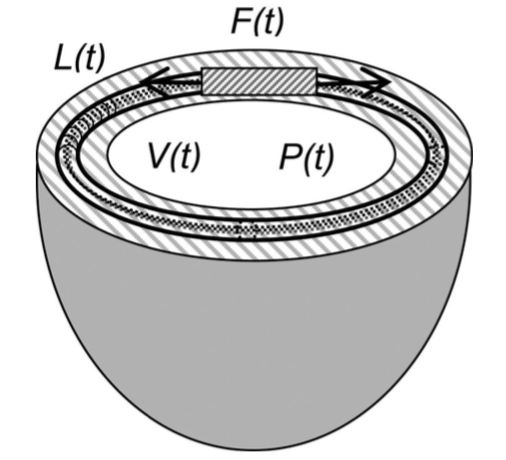
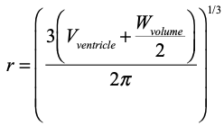
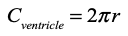
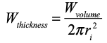
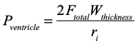

# Single Ventricle
{:.no_toc}

* Toc 
{:toc}

## Overview

The **Single Ventricle** module is originally adopted by [Campbell KB. et al.](http://journals.physiology.org/doi/full/10.1152/japplphysiol.00912.2007) where they assumed a thin walled hemispherical geometry for the left ventricle.

**PyMyoVent** uses similar assumption and considers the whole heart as a single hemispherical left ventricle. In this model the half-sarcomeres are assumed to be circumferentially oriented at the basal mid-wall of the hemisphere, i.e., the mid-transmural wall in the middle of the LV wall thickness.

* Single ventricle geometry adopted from [Campbell KB. et al.](http://journals.physiology.org/doi/full/10.1152/japplphysiol.00912.2007) work. 
## Theory

This module, in particular, governs two characteristics of the ventricle:

1. The associated change in half-sarcomeres length due to the change in ventricular volume.
    - The associated mid-wall radius to the hemispherical volume, which is related to the LV cavity volume and half of the LV wall volume can be defined as follows: 

    

    - Where:
        - *Vventricle* is the cavity volume of the ventricle derived from the [circulatory](../circulatory/circulatory.html) module.
        - *Wvolume* is the volume of ventricle wall.

    - The associated circumference of mid-wall at the basal level is defined with the following equation. The change in the mid-wall circumference enforces the change in the half-sarcomeres length. 

    

    - And finally the ventricular wall thickness is determined with:

    

    - Where:
        - *ri* is the internal radius of the left ventricle.

2. The ventricular pressure according to Laplace's law.

    

    - Where: 
        - *ri* is the internal radius of the left ventricle.
        - *Wthickness* is the ventricular wall thickness.
        - *Ftotal* is the total stress in the half-sarcomeres.

