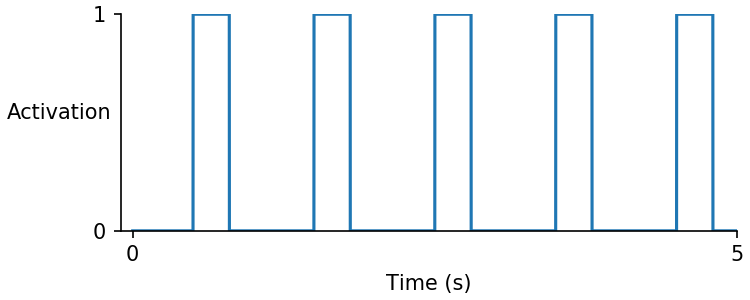

# System Control
{:.no_toc}

* Toc 
{:toc}

## Overview

This module controls how a single simulation should be run and whether the simulation needs being controlled or not.

So far, there are two approaches implemented into the **System Control** module, but any new approach can be easily added. 


## Theory

In general, **System Control** governs a simulation's running time, resolution, and the stimulus puls. But based on the complexity level, an indiviual user can select between two approached implemented so far:

1. Fixed heart rate approch
2. Simple baroreceptor approach


### Fixed heart rate

- This approach assumes a simulation runs with a constant heart rate. The activation pulse is defined based on a periodic square-wave waveform. 



- An individual user can define the signal period and also the signal stimulus duration (i.e. duty ratio) at each period. 

- The resolution of simulation is defined with `time_step` parameter. The finer the resolution, the more precise the results get, but it takes a longer simulation time. 

#### Parameters

````
"fixed_heart_rate":{
      "simulation":{
        "no_of_time_points": [5000],
        "time_step": [0.001],
        "duty_ratio": [0.3],
        "basal_heart_period": [1,"s"]
      }
    },
````
- Despite the **Simple Baroreceptor** approach, this method does not regulate any parameter in the simulation due to any perturbation. Hence, the simulation 

### Simple baroreceptor


#### Parameters

````
"simple_baroreceptor":{
      "simulation":{
        "start_index":[2000],
        "memory":[2,"s"],
        "no_of_time_points": [15000],
        "time_step": [0.001],
        "duty_ratio": [0.003],
        "basal_heart_period": [1,"s"]
      },
      "afferent": {
        "b_max": [2],
        "b_min": [0],
        "S": [0.067,"mmHg"],
        "P_n": [90,"mmHg"]
      },
      "regulation":{
        "heart_period":{
          "G_T": [0.03]
        },
        "k_1":{
          "G_k1": [-0.05]
        },
        "k_3":{
          "G_k3": [-0.0]
        },
        "k_on":{
          "G_k_on":[0.02]
        },
        "ca_uptake":{
          "G_up": [-0.02]
        },
        "g_cal":{
          "G_gcal": [-0.03]
        }
      }
    }
````