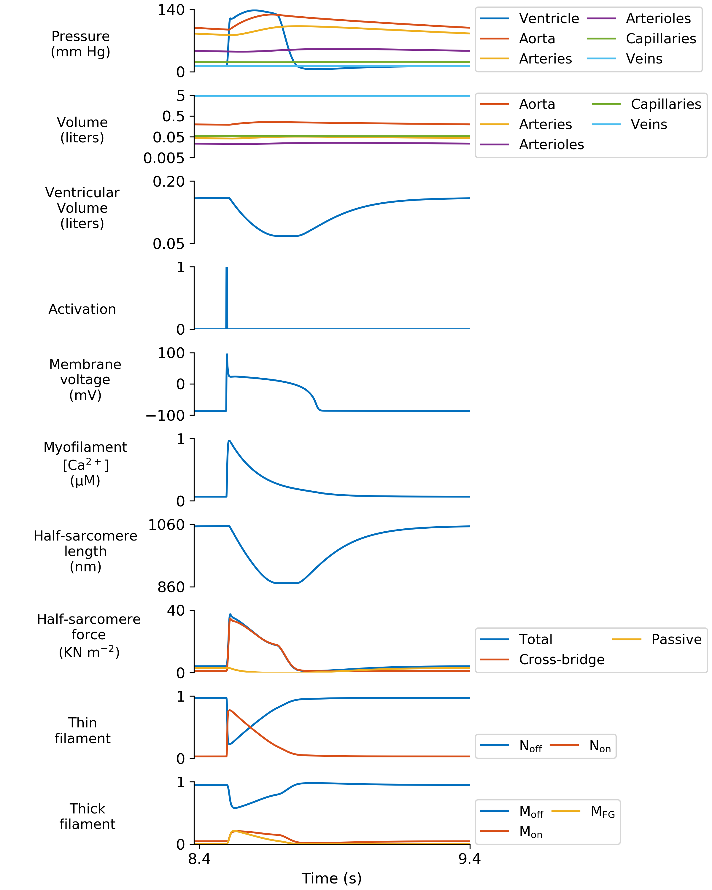

# Figure 3
{:.no_toc}

* TOC
{:toc}

## Demos

````
{
  "output_parameters": {
    "excel_file": ["..\\temp\\frontier_base_simulation\\frontier_base_simulation.xlsx"],
    "csv_file": ["..\\temp\\frontier_base_simulation\\frontier_base_simulation.csv"],
    "input_file": ["..\\temp\\frontier_base_simulation\\frontier_base_simulation.json"],
    "summary_figure": ["..\\temp\\frontier_base_simulation\\frontier_base_simulation_summary.png"],
    "pv_figure": ["..\\temp\\frontier_base_simulation\\frontier_base_simulation_pv.png"],
    "baro_figure": ["..\\temp\\frontier_base_simulation\\frontier_base_simulation_baro.png"],
    "flows_figure": ["..\\temp\\frontier_base_simulation\\frontier_base_simulation_flows.png"],
    "hs_fluxes_figure": ["..\\temp\\frontier_base_simulation\\frontier_base_simulation_hs_fluxes.png"]
  },
  "baroreflex": {
    "baro_scheme": ["fixed_heart_rate"],
    "fixed_heart_rate":{
      "simulation":{
        "no_of_time_points": [17000],
        "time_step": [0.001],
        "duty_ratio": [0.003],
        "basal_heart_period": [1,"s"]
      }
    },
    "simple_baroreceptor":{
      "simulation":{
        "start_index":[2000],
        "memory":[2,"s"],
        "no_of_time_points": [150000],
        "time_step": [0.001],
        "duty_ratio": [0.003],
        "basal_heart_period": [1,"s"]
      },
      "afferent": {
        "b_max": [2],
        "b_min": [0],
        "S": [0.067,"mmHg"],
        "P_n": [90,"mmHg"]
      },
      "regulation":{
        "heart_period":{
          "G_T": [0.03]
        },
        "k_1":{
          "G_k1": [-0.05]
        },
        "k_on":{
          "G_k_on":[0.02]
        },
        "ca_uptake":{
          "G_up": [-0.02]
        },
        "g_cal":{
          "G_gcal": [-0.03]
        }
      }
    }
  },
  "perturbations": {
    "perturbation_activation":[true],
    "volume":{
      "start_index": [10000],
      "stop_index": [15000],
      "increment": [-6e-4]
    },
    "valve":{
      "aortic":{
        "start_index": [0],
        "stop_index": [0],
        "increment": [0]
      },
      "mitral":{
        "start_index": [0],
        "stop_index": [0],
        "increment": [0]
      }
    },
    "compliance": {
      "aorta":{
        "start_index": [0],
        "stop_index": [0],
        "increment": [0]
      },
      "capillaries": {
        "start_index": [0],
        "stop_index": [0],
        "increment": [0]
      },
      "venous":{
        "start_index": [0],
        "stop_index": [0],
        "increment": [0]
      }
    },
    "resistance": {
      "aorta":{
        "start_index": [0],
        "stop_index": [0],
        "increment": [0]
      },
      "capillaries": {
        "start_index": [0],
        "stop_index": [0],
        "increment": [0]
      },
      "venous":{
        "start_index": [0],
        "stop_index": [0],
        "increment": [0]
      },
      "ventricle":{
        "start_index": [0],
        "stop_index": [0],
        "increment": [0]
      }
    },
    "myosim":{
      "k_1":{
        "start_index": [0],
        "stop_index": [0],
        "increment": [0]
      },
      "k_2":{
        "start_index": [0],
        "stop_index": [0],
        "increment": [0]
      },
      "k_4_0":{
        "start_index": [0],
        "stop_index": [0],
        "increment": [0]
      }
    },
    "ca_handling":{
      "ca_uptake":{
        "start_index": [0],
        "stop_index": [0],
        "increment": [0]
      },
      "ca_leak":{
        "start_index": [0],
        "stop_index": [0],
        "increment": [0]
      },
      "g_cal":{
        "start_index": [0],
        "stop_index": [0],
        "increment": [0]
      }
    }
  },
  "circulation":{
    "no_of_compartments": [6],
    "blood":{
      "volume":[5,"liters"]
    },
    "aorta":{
      "resistance": [40,"s"],
      "compliance": [0.002,"liter_per_mmHg"]
    },
    "arteries":{
      "resistance": [200,"s"],
      "compliance": [0.0005,"liter_per_mmHg"]
    },
    "arterioles":{
      "resistance": [500,"s"],
      "compliance": [0.0005,"liter_per_mmHg"]
    },
    "capillaries":{
      "resistance": [300,"s"],
      "compliance": [0.0025,"liter_per_mmHg"]
    },
    "veins":{
      "resistance": [100,"s"],
      "compliance": [0.35,"liter_per_mmHg"]
    },
    "ventricle":{
      "resistance": [20,"s"],
      "wall_volume": [0.1,"liters"],
      "slack_volume": [0.08,"liters"],
      "wall_density": [1055,"g/l"],
      "body_surface_area": [1.90,"m^2"]
    }
  },
  "half_sarcomere":{
    "max_rate": [5000,"s^-1"],
    "temperature": [288, "Kelvin"],
    "cb_number_density": [6.9e16, "number of cb's/m^2"],
    "initial_hs_length": [900, "nm"],
    "ATPase_activation":[false],
    "delta_energy":[70,"kJ/mol"],
    "avagadro_number":[6.02e23,"mol^-1"],
    "reference_hs_length":[1100,"nm"],

    "myofilaments":{
      "kinetic_scheme": ["3state_with_SRX"],
      "k_1": [2,"s^-1"],
      "k_force": [1e-3, "(N^-1)(m^2)"],
      "k_2": [200, "s^-1"],
      "k_3": [100, "(nm^-1)(s^-1)"],
      "k_4_0": [200, "s^-1"],
      "k_4_1": [0.1, "nm^-4"],
      "k_cb": [0.001, "N*m^-1"],
      "x_ps": [5, "nm"],
      "k_on": [5e8, "(M^-1)(s^-1)"],
      "k_off": [200, "s^-1"],
      "k_coop": [5],
      "bin_min": [-10, "nm"],
      "bin_max": [10, "nm"],
      "bin_width": [1, "nm"],
      "filament_compliance_factor": [0.5],
      "thick_filament_length": [815, "nm"],
      "thin_filament_length": [1120, "nm"],
      "bare_zone_length": [80, "nm"],
      "k_falloff": [0.0024],
      "passive_mode": ["exponential"],
      "passive_exp_sigma": [500],
      "passive_exp_L": [80],
      "passive_l_slack": [900, "nm"]
    },
    "membranes": {
      "kinetic_scheme": ["Ten_Tusscher_2004"],
      "simple_2_compartment":{
        "Ca_content": [1e-3],
        "k_leak": [2e-3],
        "k_act": [5e-2],
        "k_serca": [10.0]
      },
      "Ten_Tusscher_2004":{
        "g_to_factor": [1],
        "g_Kr_factor": [1],
        "g_Ks_factor": [1],
        "Ca_a_rel_factor": [1],
        "Ca_V_leak_factor": [1],
        "Ca_Vmax_up_factor": [1],
        "g_CaL_factor": [1]
    }
  }
},
  "growth": {
    "growth_activation": [false],
    "start_index": [200000],
    "moving_average_window": [5000],
    "driven_signal": ["stress"],
    "concenrtric":{
      "G_stress_driven":[1e-6],
      "G_ATPase_driven":[-2]
    },
    "eccentric":{
      "G_number_of_hs":[-3e-6],
      "G_ATPase_driven":[0]
    }
  },
  "profiling":{
    "profiling_activation":[false]
  },
  "saving_to_spreadsheet":{
    "saving_data_activation":[true],
    "output_data_format":["csv"],
    "start_index":[0],
    "stop_index":[17000]
  },
  "multi_threads" :{
    "multithreading_activation":[false],
    "parameters_in":{
      "G_wall_thickness": {
        "values":[25,50,100,200,300],
        "param_out":["ventricle_wall_thickness"],
        "section": ["growth"]
      },
      "G_number_of_hs": {
        "values":[25,50,100,200,300],
        "param_out":["number_of_hs"],
        "section": ["growth"]
      }
    },
    "output_main_folder": ["..\\temp\\frontier_base_simulation\\demo_i_j\\demo_i_j.json"]
  }
}
````

## Python Script

````

def range(x, axis=0):
    return np.max(x, axis=axis) - np.min(x, axis=axis)

def display_Fig3 (data_structure, output_file_string="",
                            t_limits=[],dpi=300):

    # unit multipliers
    membrane_voltage_factor = 1000 # Convert Voltage to mili-Voltage
    myo_ca_transient_factor = 1e6 # Convert Mol to micro-Mol
    sarcomeric_force_factor = 1e-3 # Convert N to KN


    # y-lim thresholds
    pressure_lim = [0,140]              # in mm Hg
    vol_lim = [0.005,5]                 # in liters
    vent_vol_lim = [0.05,0.20]          # in liters
    act_lim = [0,1]                     # unitless
    mem_volt_lim = [-100,100]           # in mili-Voltage
    myof_ca_lim = [0,1]                 # in micro-Mol
    sarc_length_lim = [860,1060]        # in nano-meter
    sarc_force_lim = [0,40]             # in kilo-pascal
    thin_fila_lim = [0,1]               # unitless
    thick_fila_lim = [0,1]              # unitless


    # Developing plots
    no_of_rows = 10
    no_of_cols = 1
    f = plt.figure(constrained_layout=True)
    f.set_size_inches([8, 10])
    spec2 = gridspec.GridSpec(nrows=no_of_rows, ncols=no_of_cols,
                              figure=f,width_ratios=[1])


    # ***Plot pressure data***
    ax1 = f.add_subplot(spec2[0, 0])
    ax1.plot('time', 'pressure_ventricle',  data=data_structure, label='Ventricle',color='#0470BE')
    ax1.plot('time', 'pressure_aorta', data=data_structure, label='Aorta',color='#D8501A')
    ax1.plot('time', 'pressure_arteries', data=data_structure, label='Arteries',color='#EEAF1F')
    ax1.plot('time', 'pressure_arterioles', data=data_structure, label='Arterioles',color='#802D90')
    ax1.plot('time', 'pressure_capillaries', data=data_structure, label='Capillaries',color='#75AC2F')
    ax1.plot('time', 'pressure_veins',  data=data_structure, label='Veins',color='#4DBEEF')
    # remove the unnecessary ax frames
    ax1.spines['top'].set_visible(False)
    ax1.spines['right'].set_visible(False)
    ax1.spines['bottom'].set_visible(False)
    # X_axis
    if t_limits:
        ax1.set_xlim([t_limits[0]-0.02*range(t_limits),t_limits[1]])
    ax1.set_xticks([])
    # Y axis
    ax1.set_ylim(pressure_lim)
    ax1.set_yticks(pressure_lim)
    ax1.set_ylabel('Pressure\n(mm Hg)', fontsize = 11,rotation=0,labelpad=20,y=0.2)
    # other adjustments
    ax1.tick_params(labelsize = 12)
    ax1.legend(loc=(1.02, 0.0),ncol=2,fontsize = 11,columnspacing=0.6)


    # ***Plot Volume data***
    ax2 = f.add_subplot(spec2[1, 0])
    ax2.semilogy('time', 'volume_aorta', data=data_structure, label='Aorta',color='#D8501A')
    ax2.semilogy('time', 'volume_arteries', data=data_structure, label='Arteries',color='#EEAF1F')
    ax2.semilogy('time', 'volume_arterioles', data=data_structure, label='Arterioles',color='#802D90')
    ax2.semilogy('time', 'volume_capillaries', data=data_structure, label='Capillaries',color='#75AC2F')
    ax2.semilogy('time', 'volume_veins',  data=data_structure, label='Veins',color='#4DBEEF')
    # remove the unnecessary ax frames
    ax2.spines['top'].set_visible(False)
    ax2.spines['right'].set_visible(False)
    ax2.spines['bottom'].set_visible(False)
    # X_axis
    if t_limits:
        ax2.set_xlim([t_limits[0]-0.02*range(t_limits),t_limits[1]])
    ax2.set_xticks([])
    # Y_axis
    ax2.set_ylim(vol_lim)
    ax2.minorticks_off()
    y_ticks = [0.005,0.05,0.5, 5]
    ax2.set_yticks(y_ticks)
    ax2.get_yaxis().set_major_formatter(tk.FixedFormatter(seq =y_ticks))
    ax2.set_ylabel('Volume\n(liters)', fontsize = 11,rotation=0,labelpad=20,y=0.2)
    # other adjustments
    ax2.tick_params(labelsize = 12)
    ax2.legend(loc=(1.02, 0.0),fontsize = 11, ncol=2,columnspacing=0.6)


    # ***Plot vetricular volume data***
    ax3 = f.add_subplot(spec2[2, 0])
    ax3.plot('time', 'volume_ventricle', data=data_structure, label='Ventricle',color='#0470BE')
    # remove the unnecessary ax frames
    ax3.spines['top'].set_visible(False)
    ax3.spines['right'].set_visible(False)
    ax3.spines['bottom'].set_visible(False)
    # X_axis
    if t_limits:
        ax3.set_xlim([t_limits[0]-0.02*range(t_limits),t_limits[1]])
    ax3.set_xticks([])
    # Y_axis
    ax3.set_ylim(vent_vol_lim)
    ax3.set_yticks(vent_vol_lim)
    ax3.set_ylabel('Ventricular\nVolume\n(liters)', fontsize = 11,rotation=0,labelpad=20,y=0.2)
    # other adjustments
    ax3.tick_params(labelsize = 12)


    # ***Plot activation data***
    ax4 = f.add_subplot(spec2[3, 0])
    ax4.plot('time', 'activation', data=data_structure, label='Activation',color='#0470BE')
    # remove the unnecessary ax frames
    ax4.spines['top'].set_visible(False)
    ax4.spines['right'].set_visible(False)
    ax4.spines['bottom'].set_visible(False)
    # X_axis
    if t_limits:
        ax4.set_xlim([t_limits[0]-0.02*range(t_limits),t_limits[1]])
    ax4.set_xticks([])
    #Y_axis
    ax4.set_ylim(act_lim)
    ax4.set_yticks(act_lim)
    ax4.set_ylabel('Activation', fontsize = 11,rotation=0,labelpad=20,y=0.2)
    # other adjustments
    ax4.tick_params(labelsize = 12)


    # ***Plot membrane coltage data***
    ax5 = f.add_subplot(spec2[4, 0])
        # convert the y_axis from voltage to mili_voltage
    y_axis = data_structure['membrane_voltage']*membrane_voltage_factor
    x_axis = data_structure['time']
    ax5.plot(x_axis, y_axis, label='Voltage',color='#0470BE')
    # remove the unnecessary ax frames
    ax5.spines['top'].set_visible(False)
    ax5.spines['right'].set_visible(False)
    ax5.spines['bottom'].set_visible(False)
    # X_axis
    if t_limits:
        ax5.set_xlim([t_limits[0]-0.02*range(t_limits),t_limits[1]])
    ax5.set_xticks([])
    # Y_axis
    ax5.set_ylim(mem_volt_lim)
    ax5.set_yticks([mem_volt_lim[0],0,mem_volt_lim[1]])
    ax5.set_ylabel('Membrane\nvoltage\n(mV)', fontsize = 11,rotation=0,labelpad=20,y=0.2)
    # other adjustments
    ax5.tick_params(labelsize = 12)


    # ***Plot myofilament Ca transient data***
    ax6 = f.add_subplot(spec2[5, 0])
        # convert the y_axis from Mol to micro-Mol
    y_axis = data_structure['Ca_conc']*myo_ca_transient_factor
    x_axis = data_structure['time']
    ax6.plot(x_axis, y_axis, label='Ca concentration',color='#0470BE')
    # remove the unnecessary ax frames
    ax6.spines['top'].set_visible(False)
    ax6.spines['right'].set_visible(False)
    ax6.spines['bottom'].set_visible(False)
    # X_axis
    if t_limits:
        ax6.set_xlim([t_limits[0]-0.02*range(t_limits),t_limits[1]])
    ax6.set_xticks([])
    # Y_axis
    ax6.set_ylim(myof_ca_lim)
    ax6.set_yticks(myof_ca_lim)
    ax6.set_ylabel('Myofilament\n$[Ca^{2+}]$\n(\u03BCM)' , fontsize = 11,rotation=0,labelpad=20,y=0.2)
    # other adjustments
    ax6.tick_params(labelsize = 12)


    # ***Plot half-sarcomere length data***
    ax7 = f.add_subplot(spec2[6, 0])
    ax7.plot('time', 'hs_length', data=data_structure, label='hs_length',color='#0470BE')
    # remove the unnecessary ax frames
    ax7.spines['top'].set_visible(False)
    ax7.spines['right'].set_visible(False)
    ax7.spines['bottom'].set_visible(False)
    # X_axis
    if t_limits:
        ax7.set_xlim([t_limits[0]-0.02*range(t_limits),t_limits[1]])
    ax7.set_xticks([])
    # Y_axis
    ax7.set_ylim(sarc_length_lim)
    ax7.set_yticks(sarc_length_lim)
    ax7.set_ylabel('Half-sarcomere\nlength\n(nm)', fontsize = 11,rotation=0,labelpad=35,y=0.2)
    # other adjustments
    ax7.tick_params(labelsize = 12)


    # ***Plot half-sarcomere force data***
    ax8 = f.add_subplot(spec2[7, 0])
        # convert the y_axis from pascal to kilo-pascal
    y1_axis = data_structure['hs_force']*sarcomeric_force_factor
    y2_axis = data_structure['cb_force']*sarcomeric_force_factor
    y3_axis = data_structure['pas_force']*sarcomeric_force_factor
    x_axis = data_structure['time']
    ax8.plot(x_axis, y1_axis,label='Total',color='#0470BE')
    ax8.plot(x_axis, y2_axis,label='Cross-bridge',color='#D8501A')
    ax8.plot(x_axis, y3_axis,label='Passive',color='#EEAF1F')
    # remove the unnecessary ax frames
    ax8.spines['top'].set_visible(False)
    ax8.spines['right'].set_visible(False)
    ax8.spines['bottom'].set_visible(False)
    # X_axis
    if t_limits:
        ax8.set_xlim([t_limits[0]-0.02*range(t_limits),t_limits[1]])
    ax8.set_xticks([])
    # Y_axis
    ax8.set_ylim(sarc_force_lim)
    ax8.set_yticks(sarc_force_lim)
    ax8.set_ylabel('Half-sarcomere\nforce\n(KN $m^{-2}$)', fontsize = 11,rotation=0,labelpad=40,y=0.2)
    # other adjustments
    ax8.tick_params(labelsize = 12)
    ax8.legend(loc=(1.02, 0.0),fontsize = 11,ncol=2,columnspacing=0.6)


    # ***Plot thin-filament data***
    ax9 = f.add_subplot(spec2[8, 0])
    ax9.plot('time', 'n_off', data=data_structure, label='$N_{off}$',color='#0470BE')
    ax9.plot('time', 'n_on', data=data_structure, label='$N_{on}$',color='#D8501A')
    # remove the unnecessary ax frames
    ax9.spines['top'].set_visible(False)
    ax9.spines['right'].set_visible(False)
    ax9.spines['bottom'].set_visible(False)
    # X_axis
    if t_limits:
        ax9.set_xlim([t_limits[0]-0.02*range(t_limits),t_limits[1]])
    ax9.set_xticks([])
    # Y_axis
    ax9.set_ylim(thin_fila_lim)
    ax9.set_yticks(thin_fila_lim)
    ax9.set_ylabel('Thin\nfilament', fontsize = 11,rotation=0,labelpad=45,y=0.2)
    # other adjustments
    ax9.tick_params(labelsize = 12)
    ax9.legend(loc=(1.02, 0.0),fontsize = 11,ncol=2,columnspacing=0.6)


    # ***Plot thick-filament data***
    ax10 = f.add_subplot(spec2[9, 0])
    ax10.plot('time', 'M_OFF', data=data_structure, label='$M_{off}$',color='#0470BE')
    ax10.plot('time', 'M_ON', data=data_structure, label='$M_{on}$',color='#D8501A')
    ax10.plot('time', 'M_bound', data=data_structure, label='$M_{FG}$',color='#EEAF1F')
    # remove the unnecessary ax frames
    ax10.spines['top'].set_visible(False)
    ax10.spines['right'].set_visible(False)
    # X_axis
    if t_limits:
        ax10.set_xlim([t_limits[0]-0.02*range(t_limits),t_limits[1]])
        ax10.set_xticks(t_limits)
    ax10.set_xlabel('Time (s)',fontsize=12)
    # Y_axis
    ax10.set_ylim(thick_fila_lim)
    ax10.set_yticks(thick_fila_lim)
    ax10.set_ylabel('Thick\nfilament', fontsize = 11,rotation=0,labelpad=45,y=0.2)
    # other adjustments
    ax10.tick_params(labelsize = 12)
    ax10.legend(loc=(1.02, 0.0),fontsize = 11,ncol=2,columnspacing=0.6)

    # change the mathematical notatio format
    rcParams['mathtext.default'] = 'regular'
    f.align_ylabels()

    # save the figure
    if (output_file_string):
        save_figure_to_file(f, output_file_string, dpi)

def save_figure_to_file(f, im_file_string, dpi=None, verbose=0):
    # Writes an image to file

    import os
    from skimage.io import imsave

    # Check directory exists and save image file
    dir_path = os.path.dirname(im_file_string)
    if not os.path.isdir(dir_path):
        os.makedirs(dir_path)

    if (verbose):
        print('Saving figure to to %s' % im_file_string)

    f.savefig(im_file_string, dpi=dpi)

if __name__ == "__main__":
    # import required libraries
    import os
    import sys
    import json
    import pandas as pd
    import numpy as np
    import matplotlib.pyplot as plt
    import matplotlib.gridspec as gridspec
    import matplotlib.ticker as tk
    from matplotlib import rcParams

    no_of_arguments = len(sys.argv)
    if (no_of_arguments == 1):
            print('Analysis called with no inputs')
    elif (no_of_arguments == 2):
        print('Running model %s' % sys.argv[1])
        data_path = sys.argv[1]
        data = pd.read_csv(data_path)
        current_directory = os.getcwd()

        display_Fig3(data,current_directory+'/'+'Fig_3.png',[8.4,9.4])

````
## Output Figure

