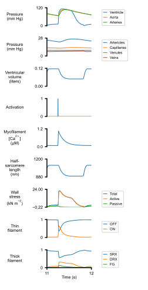
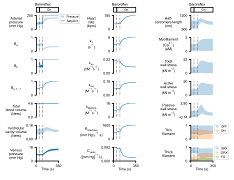
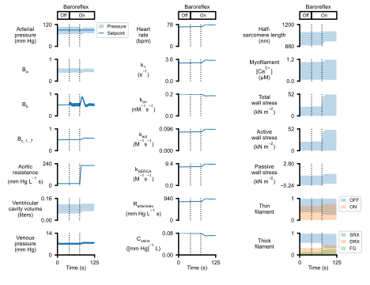
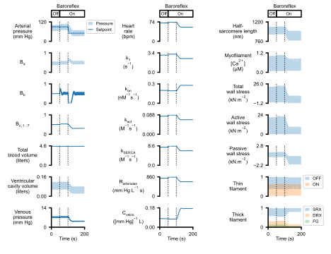
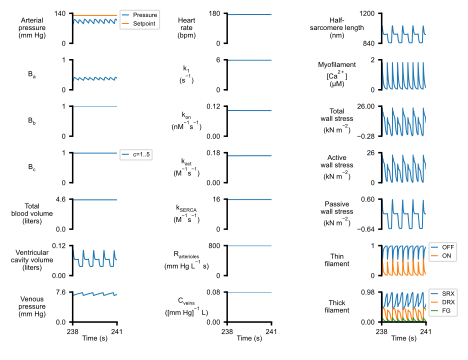
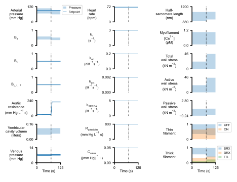
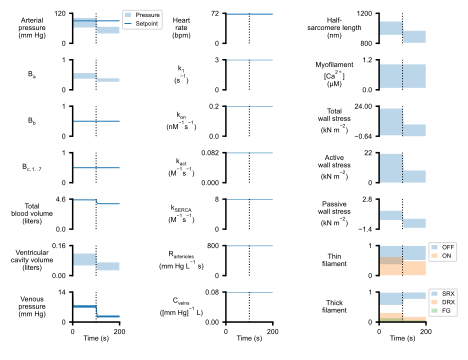

# Baroreflex
{:.no_toc}

* TOC
{:toc}

## Article

- **Title**: A multiscale model of the cardiovascular system that incorporates baroreflex control of chronotropism, cell-level contractility, and vascular tone
- **Authors**: Hossein Sharifi, Kurtis J. Mann, Jonathan F. Wenk, Kenneth S. Campbell
- **Journal**: Bioarxiv

## How to reproduce figures

+ Install the software [as described](../../installation/installation.html)
  + This manuscript is based on PyMyoVent 1.2.1
+ Open an Anaconda prompt
+ Activate the PyMyoVent environment
+ Change directory to `<PyMyoVent_repo>/Python_code`
+ Run the commmand `python pymyovent.py run_batch ../manuscripts/baroreflex/batch/batch_paper.json`
  + This may take some time
+ Use File Explorer or similar to open `<PyMyoVent_repo>/manuscripts/baroreflex/simulations/sim_output`
  + Simulation results will be in the `results` folder
  + Figures will be in the `images` folder

## Images

 
 
 
 
 
 
 
 
 
 
